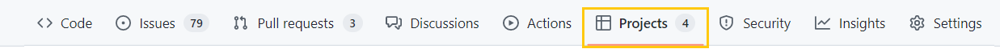
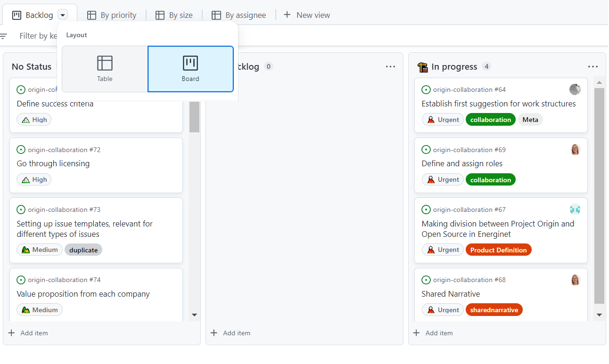
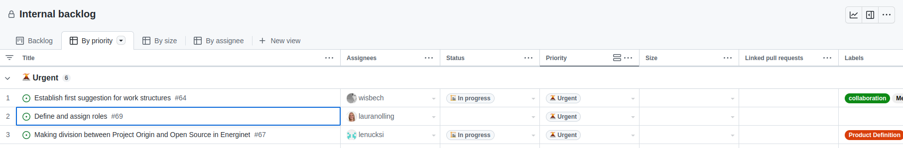
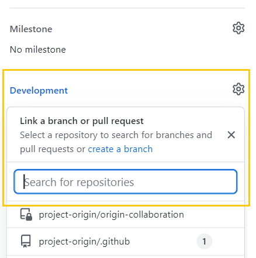
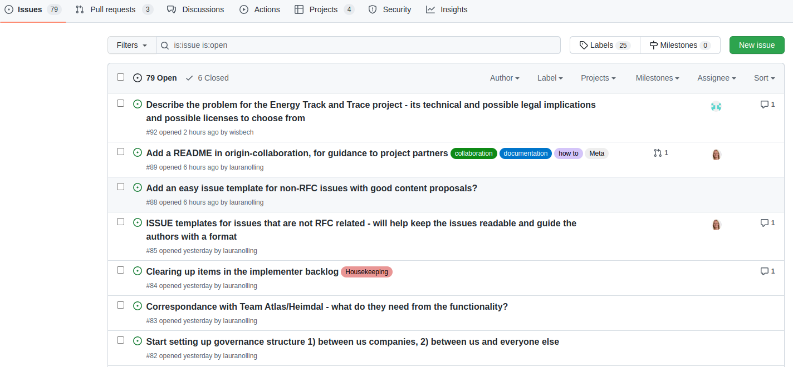
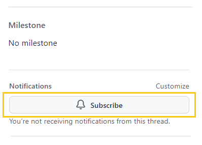

# Issue trackers in Github
This document provides an [Overview](#overview) on Issues, describing their purpose and layout on Github. Additionally, some [Guidelines](#guidelines) are provided, specifying best practices for using them here in Project Origin.  

## Overview
An issue in Github can be created to track progress on a specific task or topic. 
In this context, the term _“issue”_ should not be interpreted as “problem”, but rather as a _“subject that needs attention and action”_. 
All repositories have a tab, containing all issues created in the given repository:

Alternatively, Issues can be put into customized Project views, a list of which is found under the Projects tab:

It can be a good idea to bookmark the project view you're using often. All projects have stable links.

Projects can be viewed either Kanban (see also: Trello) style or as a list.
Both use the same **issues** as content.
Project boards can have **draft issues** that are local to the project board and have very little features. 
There's a button in the _draft_ issue to convert them to a "real" issue.

Here's how the different project views look:

As a KANBAN view:

Listview:

For more information about Github Projects, take a look at the Projects Guide. 
GitHub also offers a (slightly longer) overview [here](https://docs.github.com/en/issues/planning-and-tracking-with-projects/learning-about-projects) 

Issues can consist of several different attributes, including at least a title, issue number, creation date, and author.
### Mentioning, notifying people and tasks and cross-referencing
Each issue, pull request (request for changes to the file share) has a number visible above. 
You can cross-reference all content everywhere by just putting # and the issue number in your text. 
If you do, the referenced element will get a link to the referencing element. 
As example: #90 references the pull request that initially created this document. 
The same works for people. 
You can reference them using @ and their username. @lenucksi or @lauranolling for example.

The project views also offer you a (slightly feature reduced) way of viewing an issue if you click on an issues' title. 
See below for how it looks.

Additional attributes that are useful are 'labels', which can help indicate the type of issue, and assignees, who are the ones responsible for ensuring progress on the issue.
If you wish to change, add or delete a label, click the gear icon next to it. 
(in the big issue view, click the label in the quick issue view.) 
As work on the issue progresses, Actions related to the issue will be visible in the issue item:

If there are pull requests in the Github Organization related to the issue, these can be linked to the issue, to track progress on these as well. 

Additionally, if an issue is mentioned in a pull request, it will be added as an issue evolution line as visible above.

All issues created will be available in a list, under the “Issues” tab. Additionally, issues can be added as items in project boards, available under the “Projects” tab, with the advantage of being able to sort issues by topic, priority, status, and others. 

The issue list allows for precise filtering and mass-processing, e.g. if you want to mass update labels or clean up during a housekeeping session.

To make sure to follow progress on issues relevant to you, you can subscribe to an issue, to get notifications whenever an update happens. 

If you are mentioned in an issue or have created it, you will be automatically notified.

## Guidelines

To use issues in Project Origin, we have set up some guidelines, to make sure that all the relevant information will be included, and that it is easier to find the issues to people for whom it is relevant.
