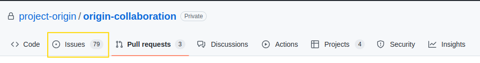
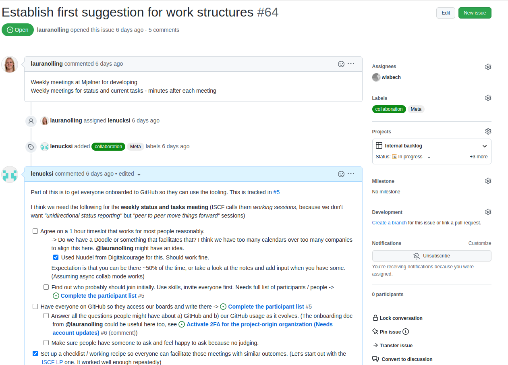
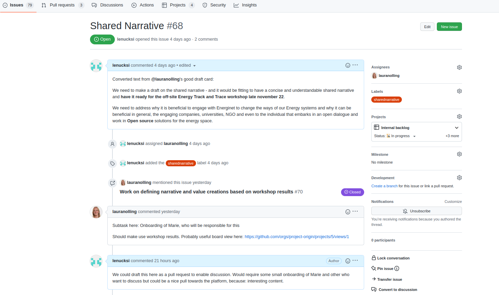
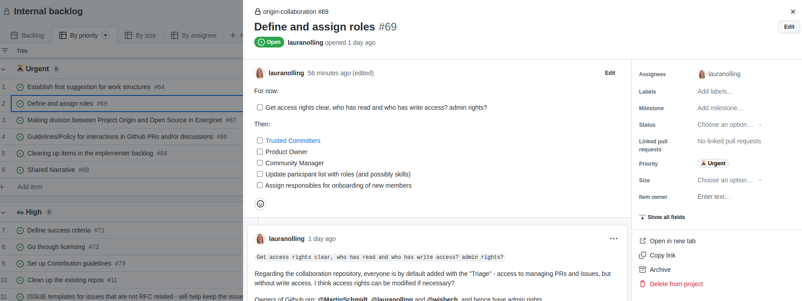

# Issue trackers in Github
This document provides an [Overview](#overview) on Issues, describing their purpose and layout on Github. Additionally, some [Guidelines](#guidelines) are provided, specifying best practices for using them here in Project Origin.  

## Overview
An issue in Github can be created to track progress on a specific task or topic. 
In this context, the term _“issue” should not be interpreted as “problem”, but rather as a “subject that needs attention and action”_. 
All repositories have a tab, containing all issues created in the given repository:

Alternatively, Issues can be put into customized Project views, a list of which is found under the Projects tab:
It can be a good idea to bookmark the project view you're using often. All projects have stable links.

IMAGE HERE

For more information about Github Projects, take a look at the Projects Guide. 

Issues can consist of several different attributes, including at least a title, issue number, creation date, and author:

The project views also offer you a (slightly feature reduced) way of viewing an issue if you click on an issues' title. 
See below for how it looks.

Additional attributes that are useful are 'labels', which can help indicate the type of issue, and assignees, who are the ones responsible for ensuring progress on the issue. As work on the issue progresses, Actions related to the issue will be visible in the issue item:

IMAGE HERE

If there are pull requests in the Github Organization related to the issue, these can be linked to the issue, to track progress on these as well. 

IMAGE HERE

All issues created will be available in a list, under the “Issues” tab. Additionally, issues can be added as items in project boards, available under the “Projects” tab, with the advantage of being able to sort issues by topic, priority, status, and others. 

IMAGES HERE

To make sure to follow progress on issues relevant to you, you can subscribe to an issue, to get notifications whenever an update happens. 

IMAGE HERE

## Guidelines

To use issues in Project Origin, we have set up some guidelines, to make sure that all the rele-vant information will be included, and that it is easier to find the issues to people for whom it is relevant. s 
