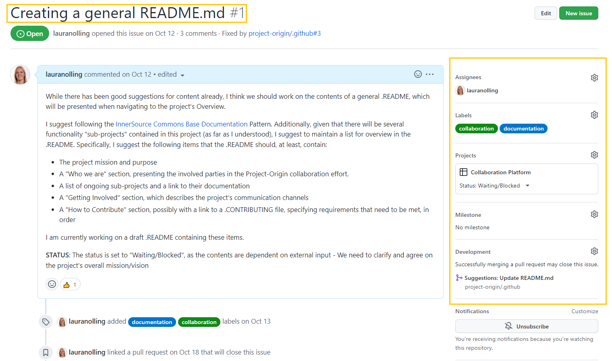
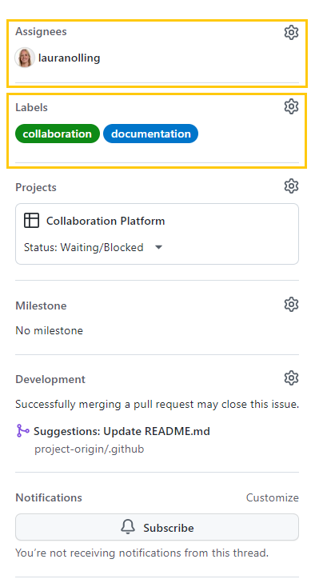
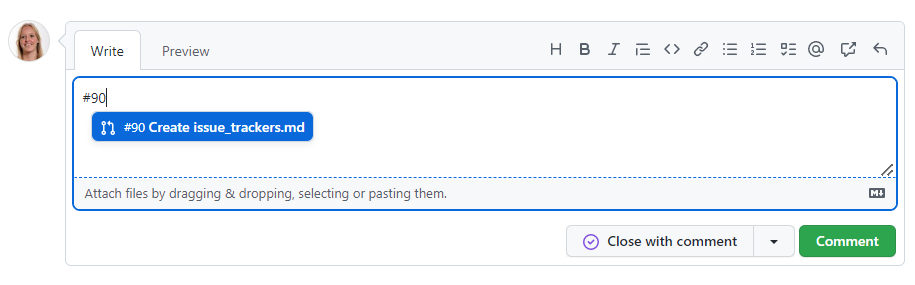
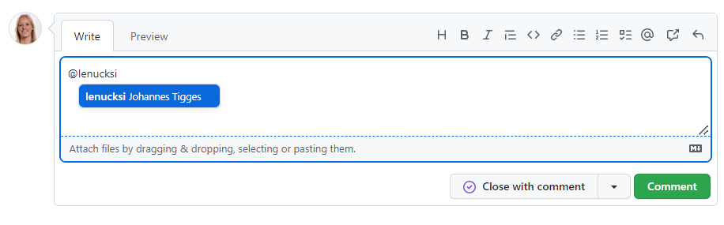
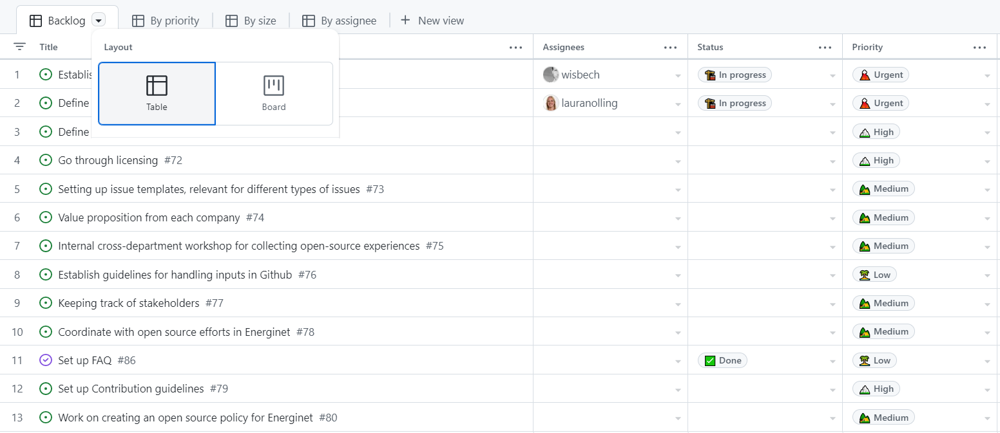

# Issue trackers in Github
This document provides an [Overview](#overview) on Issues, describing their purpose and layout on Github. Additionally, some [Guidelines](#guidelines) are provided, specifying best practices for using them here in Project Origin.  

## Overview
An issue in Github can be created to track progress on a specific task or topic. 
In this context, the term _“issue”_ should not be interpreted as “problem”, but rather as a _“subject that needs attention and action”_. 
All repositories have a tab, containing all issues created in the given repository:

In this tab, all issues created will be available in a list:

The issue list allows for precise filtering and mass-processing, e.g. if you want to mass update labels or clean up during a housekeeping session.

## Useful attributes
Issues can consist of several different attributes, including at least a title, issue number, creation date, and author.

Attributes that are useful when working with issues are 'assignees', who are the ones responsible for ensuring progress on the issue, and 'labels', which can help indicate the type of issue.

If you wish to change, add or delete a label, click on the gear icon next to it (In the [_quick issue view_](#handling-issues-directly-in-the-projects-view) click on the label). 

As work on the issue progresses, Actions related to the issue will be visible in the issue item:

If there are pull requests in the Github Organization related to the issue, these can be linked to the issue, to track progress on these as well:

To make sure to follow progress on issues relevant to you, you can subscribe to an issue, to get notifications whenever an update happens. 

If you are mentioned in an issue or have created it, you will be automatically notified.

## Mentioning, notifying people and tasks, and cross-referencing
You can cross-reference all content everywhere by just putting # and the issue number in your text. 
If you do, the referenced element will get a link to the referencing element. 
As an example: If you write _"#90"_ you reference the pull request that initially created this document. 

The same works for people. 
You can reference them using @ and their username. For example _@lenucksi_ or _@lauranolling_.

## Issues in Projects views
As an alternative to the full list of issues in the Issues tab, issues can be put into customized Project views, a list of which is found under the Projects tab:

In Projects, the advantage is that you can make your own custom views, and sort the issues by issues by topic, priority, status, and others. 
Projects can be viewed either as a KANBAN (see also: Trello) style board or as a list. Here's how the different Projects views look:

As a KANBAN view:

As a List/Table:

It can be a good idea to bookmark the project view you're using often (all projects have stable links). 
Note that you can add _items_ in the Projects views. 
These will be created as _draft issues_. 
However, these are local to the project board and have very little features. 
There's a button in the _draft issue_ to convert them to a "real" issue.

GitHub offers a further description of using Projects [here](https://docs.github.com/en/issues/planning-and-tracking-with-projects/learning-about-projects). 

### Handling issues directly in the Projects view
The Projects views also offer you a _quick issue view_ if you click on an issue's title:

## Guidelines

To use issues in Project Origin, we have set up some guidelines, to make sure that all the relevant information will be included, and that it is easier to find the issues to people for whom it is relevant.
