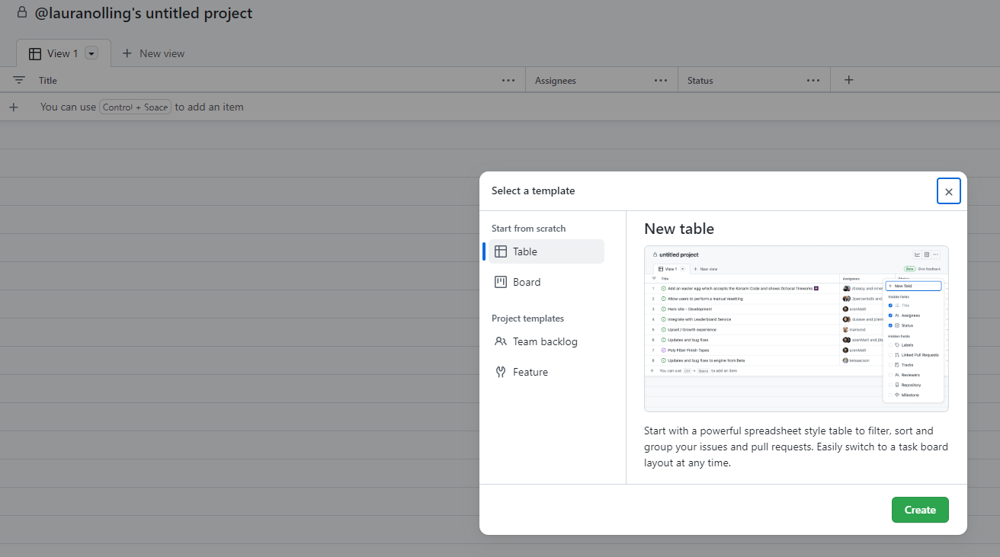
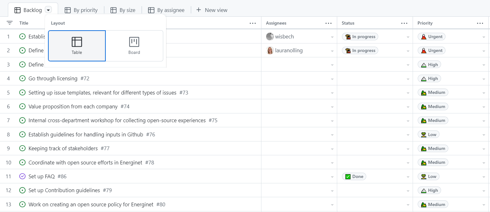
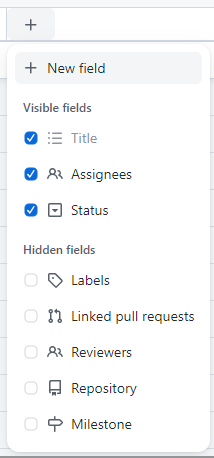
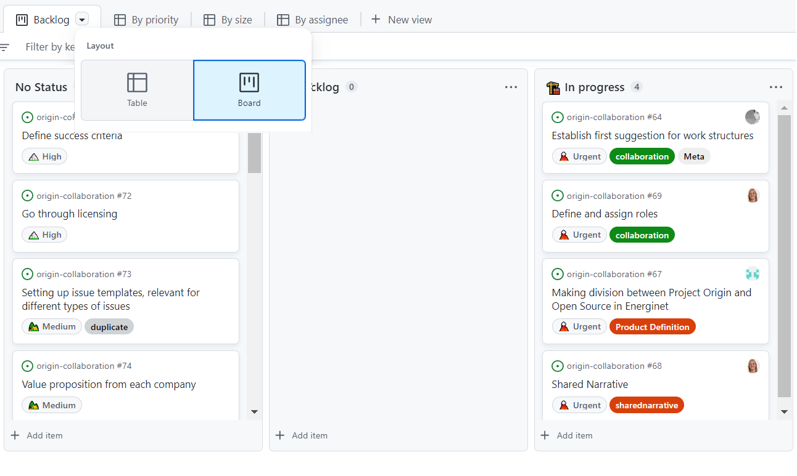
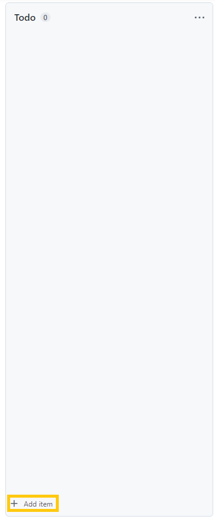
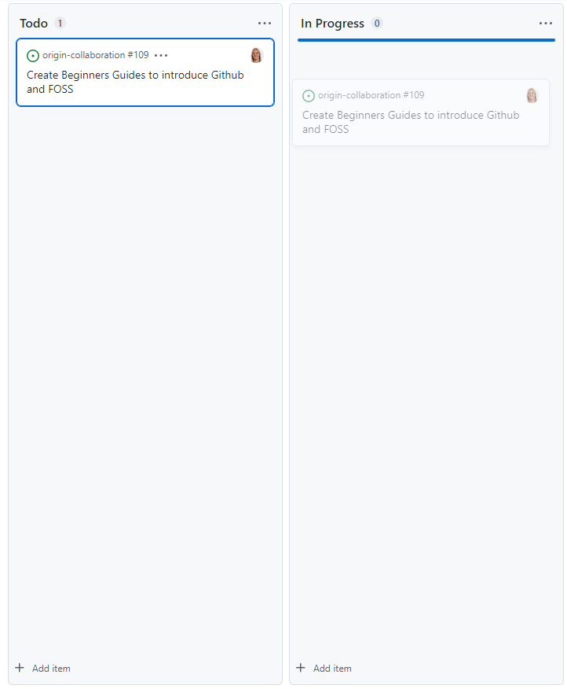
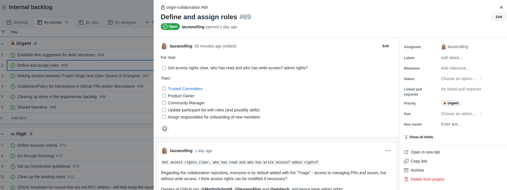
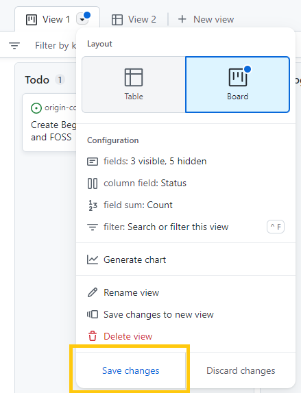
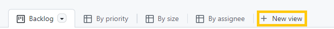

# The Projects Tool
This guide provides an overview of the Projects tool in Github, describing its purpose and layouts in Github. Additionally, . 

## Overview
The Projects feature on GitHub is a tool for organizing and tracking your work. You can use it to create different-style views to manage your issues and pull requests and keep track of your progress. It is possible to create both org-wide and repository-specific projects. To create or see existing Projects, navigate to the Projects tab:

Existing projects will be listed here. To create a new project on Github, click the "Create a Project" button- Enter a name for your project and select a template.

You can choose to show your project in _Table_ view or in _Board_ view. Here's how the different Projects views look:

In Table view:

You can add attribute fields/columns by clicking the "+" on the top right, where there are a few options on what to add:

In Board view:

In this view, you can also add new columns. 

It can be a good idea to bookmark the project view you're using often (all projects have stable links).

## Adding Cards to the Project View
Cards in the Projects tool, refers to any issues, pull requests or draft issues that you add to your project view. To add cards to your project, click on "Add item", in the buttom of the column you want to add the card to:

If you search, you can find any existing issue or pull request that you want to add. Alternatively, type some title, and a draft issue will be created (see the [Issue trackers guide](https://github.com/project-origin/origin-collaboration/blob/main/guides/issue_trackers.md#issues-in-projects-views)). 

To move a card between columns, simply drag and drop the card to the desired column:

When you click on a card title, a quick view will pop up for the (draft) issue or pull request that the card contains:

Remember to save your view, when you finished modifying it, as this doesn't happen automatically:

## Using Projects in Project-Origin
A number of projects already exists in Project-Origin, which are visible [here](https://github.com/orgs/project-origin/projects). You can either use the existing project views, whenever these are most relevant to you, or create your own view in a given, relevant project, to e.g., track progress on your own issues and pull requests. 

Alternatively, you can create your own project, if you find it relevant. 

## More Information about Projects
GitHub offers a more extensive guide on Projects [here](https://docs.github.com/en/issues/planning-and-tracking-with-projects/learning-about-projects).
