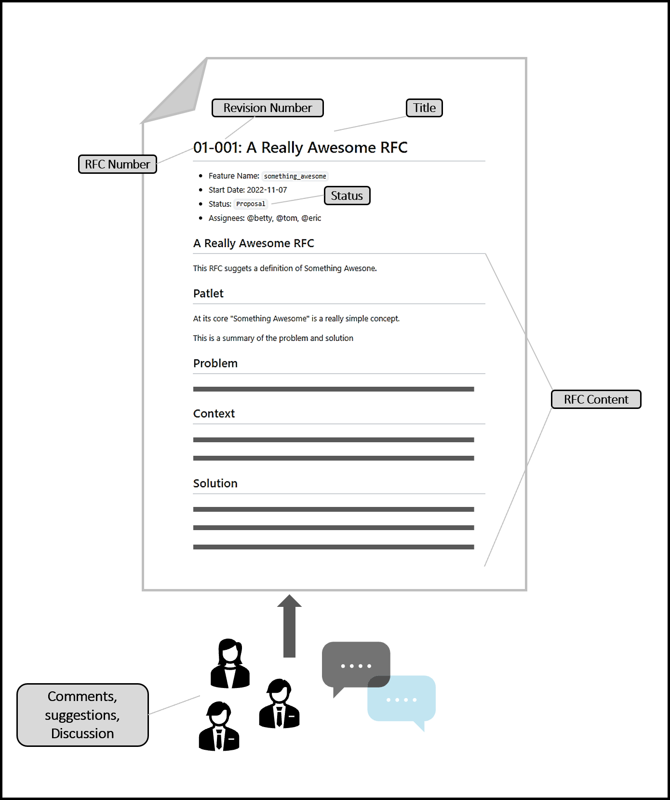

## Request for Comments (RFC)

Requests for Comment (RFCs) are written, informal pieces of information. They can be assigned with a revision number, status, and/or category, and provides the basis of discussions and decisions on the topic of the RFC. 

